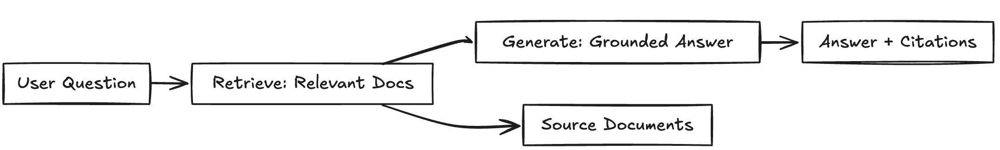

# 1. Problem Definition

  
## The Challenge: Making Private Knowledge Accessible Through AI

  

### User Need

  

Organizations and individuals possess vast amounts of domain-specific knowledge trapped in documents—research papers, internal documentation, technical manuals, and proprietary data. Traditional search engines and generic AI assistants cannot effectively utilize this private knowledge because:

  

1. **Privacy Concerns**: Sensitive documents cannot be uploaded to cloud-based AI services

2. **Knowledge Gaps**: General-purpose LLMs lack domain-specific information

3. **Hallucination Risk**: AI models often generate plausible but incorrect answers

4. **No Source Attribution**: Users cannot verify where information originated

5. And sometimes, even most frontier models can’t reliably process a 600 page book in a single pass because 600 pages correspond to roughly -320k–400k tokens, which already pushes or exceeds the effective context window of many state-of-the-art models.

  #### 🔹 **Claude (Anthropic)**

- **Context window:** ~200k tokens
    
- **Book equivalent:** ~350–450 pages
    
- **Reality:**
    
    - A 200-page book _fits comfortably_
        
    - But attention still degrades across long distances
        
    - Early chapters lose precision in reasoning tasks
        

#### 🔹 **Gemini (Google)**

- **Context window:** up to ~1M tokens (Gemini-3 family)
    
- **Book equivalent:** ~1,500–2,000 pages
    
- **Reality:**
    
    - Can ingest multiple books at once
        
    - Still suffers from **attention dilution**, not memory loss
        
    - Retrieval ≠ deep global reasoning
        

#### 🔹 **GPT-5.2 (OpenAI)**

- **Context window:** not publicly fixed, but widely observed in the **100k–200k+ token range**
    
- **Book equivalent:** ~200–400 pages
    
- **Reality:**
    
    - A 200-page book is near the **upper practical limit**
        
    - Works for summarization
        
    - Less reliable for cross-chapter, fine-grained reasoning without chunking or RAG

### Our Interpretation

  

We interpret this need as requiring a **self-hosted, privacy-preserving question-answering system** that:

  

- Runs entirely on local infrastructure (no data leaves the user's environment)

- Grounds all responses in actual document content

- Provides transparent source citations for every answer

- Supports multiple document formats (PDF, DOCX, TXT, XLSX, etc.)

  

### Solution: Local RAG System

  

**RAG (Retrieval-Augmented Generation)** addresses these challenges by:

  

  

| **Challenge**    | **RAG-Based Solution**                                              |
| ---------------- | ------------------------------------------------------------------- |
| Privacy concerns | Fully local inference using **Ollama** (no data leaves the machine) |
| Knowledge gaps   | Any document can be ingested into a **searchable knowledge base**   |
| Hallucinations   | Responses are **grounded in retrieved context**                     |
| Lack of sources  | Every answer includes **explicit document citations**               |

  

### Target Users

  

- **Researchers**: Querying personal paper collections

- **Legal professionals**: Searching contract databases

- **Technical teams**: Accessing internal documentation

- **Students**: Studying from course materials

- **Healthcare**: Retrieving medical knowledge (with privacy)

  

---

  

*This system transforms static document repositories into interactive, conversational knowledge bases—all while maintaining complete data privacy.*