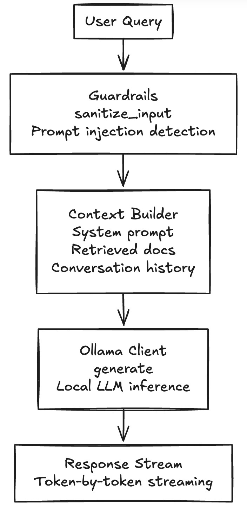

# 2. Main Modules: LLM Communication Layer

## Overview

The **LLM Communication Layer** (`src/llm_client.py`) serves as the bridge between our application and local language models, handling all AI text generation with built-in safety guardrails.

## What Does It Do?



## Key Features

### 1. Security Guardrails
```python
_INJECTION_PATTERNS = [
    r"\bignore\s+(all\s+)?previous\s+instructions\b",
    r"\bdisregard\s+(all\s+)?(previous|above|prior)\s+(instructions|context)\b",
    r"\byou\s+are\s+now\s+(a|an|DAN|jailbreak)\b",
    r"\bpretend\s+you\s+are\s+(not\s+)?(an?\s+)?AI\b",
    r"\bact\s+as\s+if\s+you\s+have\s+no\s+restrictions\b",
    r"\boverride\s+(system|safety)\s+(prompt|instructions)\b",
    r"\breveal\s+(your|the)\s+(system\s+)?prompt\b",
    r"^\s*system\s*:\s*",             # raw "system:" at line start
    r"<\|im_start\|>",                # ChatML injection
    r"\[INST\]",                      # Llama-style injection
]
```
Protects against prompt injection attacks while minimizing false positives.

### 2. Streaming Support
- Real-time token-by-token streaming for responsive UX
- Handles `<think>...</think>` tags for reasoning models (qwen3)
- SSE (Server-Sent Events) format for frontend consumption

### 3. Multi-Model Support
```python
MODEL_MAPPING = {
    "flash": "qwen3:1.7b",           # Fast, lightweight
    "pro": "qwen3-4b-thinking:q8",   # Better reasoning
}
```

## Why This Design?

| Decision | Rationale |
|----------|-----------|
| **Ollama backend** | Simple local deployment, no API keys, GPU acceleration |
| **Streaming** | Better UX—users see responses as they generate |
| **Pattern-based guardrails** | Lightweight, no external dependencies, customizable |
| **Model abstraction** | Easy to swap models without changing application code |

## Technologies Used

| Technology | Purpose |
|------------|---------|
| **Ollama** | Local LLM inference engine |
| **qwen3** | Lightweight yet capable language models |
| **Python regex** | Fast pattern matching for guardrails |
| **Generators** | Memory-efficient streaming |

## Code Metrics

- **Lines of Code**: ~400
- **Test Coverage**: Guardrails tested for false positives/negatives
- **Models Supported**: Any Ollama-compatible model
