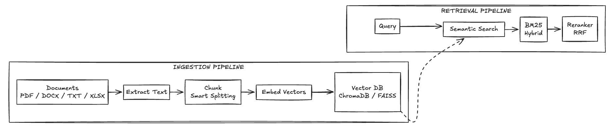

# 3. Main Modules: Document Processing & Vector Database Layer

## Overview

The **RAG Engine** (`src/rag_engine.py`) handles document ingestion, embedding generation, vector storage, and hybrid retrieval—the core intelligence of the system.

## What Does It Do?



## Key Features

### 1. Smart Chunking
```python
def _smart_chunk(self, text, chunk_size=500, overlap=100):
    # Respects sentence boundaries
    # Configurable overlap for context preservation
    # Handles code blocks and tables specially
```

### 2. Hybrid Search (Semantic + BM25)
| Method | Strength | Use Case |
|--------|----------|----------|
| **Semantic** | Understands meaning | "How does RAG reduce hallucinations?" |
| **BM25** | Exact keyword matching | "ChromaDB configuration" |
| **Combined** | Best of both worlds | General queries |

### 3. Dual Vector Store Support
```python
# ChromaDB: Default, persistent, easy setup
rag_engine_chroma = RAGEngine(backend="chroma")

# FAISS: Optional, high-performance, GPU-accelerated
rag_engine_faiss = RAGEngine(backend="faiss")
```

### 4. BM25 Caching
```python
# Cache invalidated only when corpus changes
if self._bm25_cache and len(corpus) == self._bm25_cache_size:
    bm25 = self._bm25_cache  # Reuse cached index
else:
    bm25 = BM25Okapi(tokenized)  # Rebuild
    self._bm25_cache = bm25
```

## Why This Design?

| Decision | Rationale |
|----------|-----------|
| **Hybrid search** | Semantic misses exact terms; BM25 misses synonyms—combine both |
| **Sentence-transformers** | State-of-the-art embeddings, runs locally |
| **ChromaDB default** | Zero-config, SQLite-backed, great for prototyping |
| **Optional FAISS** | Better performance at scale (millions of vectors) |
| **Chunking with overlap** | Preserves context across chunk boundaries |

## Technologies Used

| Technology | Purpose |
|------------|---------|
| **ChromaDB** | Primary vector database |
| **FAISS** | High-performance alternative |
| **sentence-transformers** | Embedding model (all-MiniLM-L6-v2) |
| **rank_bm25** | BM25 scoring for hybrid search |
| **PyMuPDF, python-docx, openpyxl** | Document parsing |

## Supported Formats

| Format | Library | Notes |
|--------|---------|-------|
| PDF | PyMuPDF | Text extraction |
| DOCX | python-docx | Full formatting |
| XLSX/CSV | openpyxl, pandas | Tabular data |
| TXT/MD | Built-in | Direct read |
| HTML | BeautifulSoup | Tag stripping |
| PPTX | python-pptx | Slide text |

## Performance Optimizations

- **BM25 caching**: Index rebuilt only on corpus change
- **Batch embeddings**: Process multiple chunks together
- **Confidence threshold**: Filter low-relevance results
- **Deduplication**: Remove repeated content during ingestion
