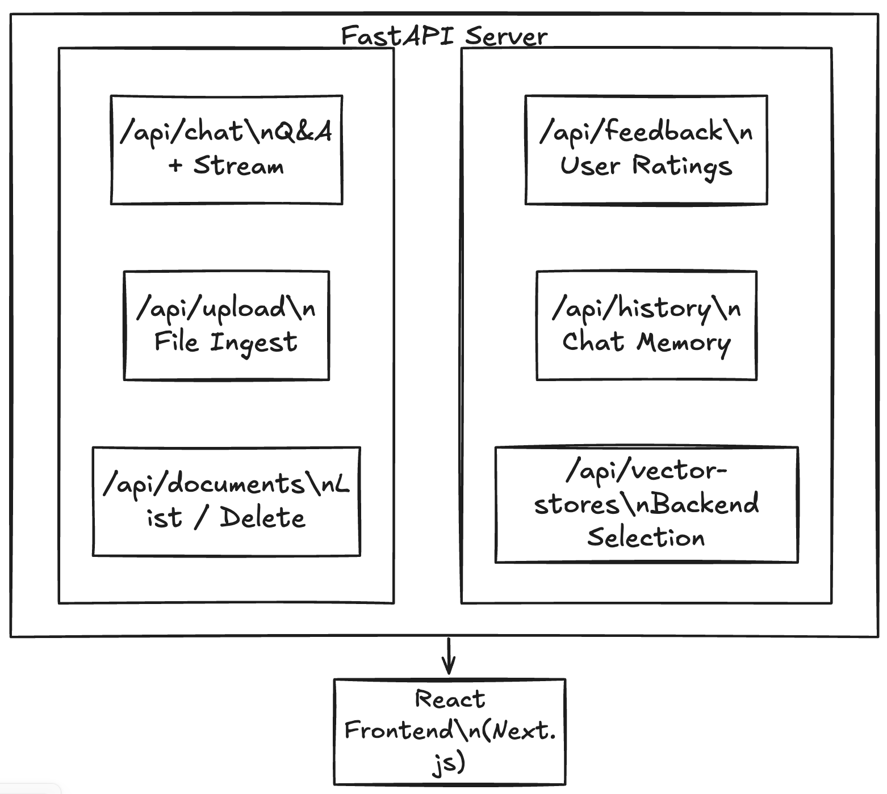

# 4. Main Modules: API & Service Layer

## Overview

The **API Layer** (`main.py`) exposes the RAG system as a RESTful web service using FastAPI, enabling browser-based and programmatic access.

## What Does It Do?



## Key Endpoints

| Endpoint | Method | Purpose |
|----------|--------|---------|
| `/api/chat` | POST | Ask questions (supports streaming) |
| `/api/upload` | POST | Upload documents for indexing |
| `/api/documents` | GET | List indexed documents |
| `/api/documents/{file}` | DELETE | Remove document from index |
| `/api/feedback` | POST | Submit user ratings |
| `/api/chat/history/{id}` | GET/DELETE | Manage conversation history |
| `/api/health` | GET | Health check |

## Key Features

### 1. Streaming Responses (SSE)
```python
@app.post("/api/chat")
async def chat(request: ChatRequest):
    if request.stream:
        return StreamingResponse(
            generate_sse_stream(...),
            media_type="text/event-stream"
        )
```

### 2. Multi-Turn Conversations
```python
# In-memory + persistent chat history
conversation_history: Dict[str, List[Dict]] = {}

def _get_history(conversation_id: str) -> List[Dict]:
    # Load from memory or disk
    # Trim to MAX_HISTORY_MESSAGES
```

### 3. Input Validation & Security
```python
class ChatRequest(BaseModel):
    question: str
    top_k: conint(ge=1, le=20) = 3
    temperature: confloat(ge=0.0, le=1.0) = 0.7
    
def _validate_conversation_id(conv_id: str) -> bool:
    # Prevent path traversal attacks
    if ".." in conv_id or conv_id.startswith("/"):
        return False
```

### 4. Dual Vector Store Support
```python
# Runtime switching between backends
vector_store = request.vector_store  # "chroma" or "faiss"
engine = rag_engines.get(vector_store, rag_engine)
```

## Why This Design?

| Decision | Rationale |
|----------|-----------|
| **FastAPI** | Async, automatic OpenAPI docs, Pydantic validation |
| **SSE streaming** | Real-time responses, better UX than polling |
| **Stateless design** | Horizontal scaling, easy deployment |
| **CORS enabled** | Separate frontend/backend deployment |
| **Pydantic validation** | Type safety, automatic error messages |

## Technologies Used

| Technology | Purpose |
|------------|---------|
| **FastAPI** | Modern async web framework |
| **Uvicorn** | ASGI server |
| **Pydantic** | Request/response validation |
| **python-multipart** | File upload handling |

## API Response Examples

### Chat Request
```json
POST /api/chat
{
  "question": "What is RAG?",
  "model": "qwen3-1.7b",
  "stream": true,
  "top_k": 5
}
```

### Chat Response (non-streaming)
```json
{
  "answer": "RAG (Retrieval-Augmented Generation) combines...",
  "sources": [
    {"source": "sample.txt", "content": "...", "score": 0.89}
  ],
  "processing_time_ms": 1234
}
```

## Test Coverage

- **24 unit tests** covering all endpoints
- Security tests for path traversal, prompt injection
- Edge cases: Unicode, long inputs, special characters
