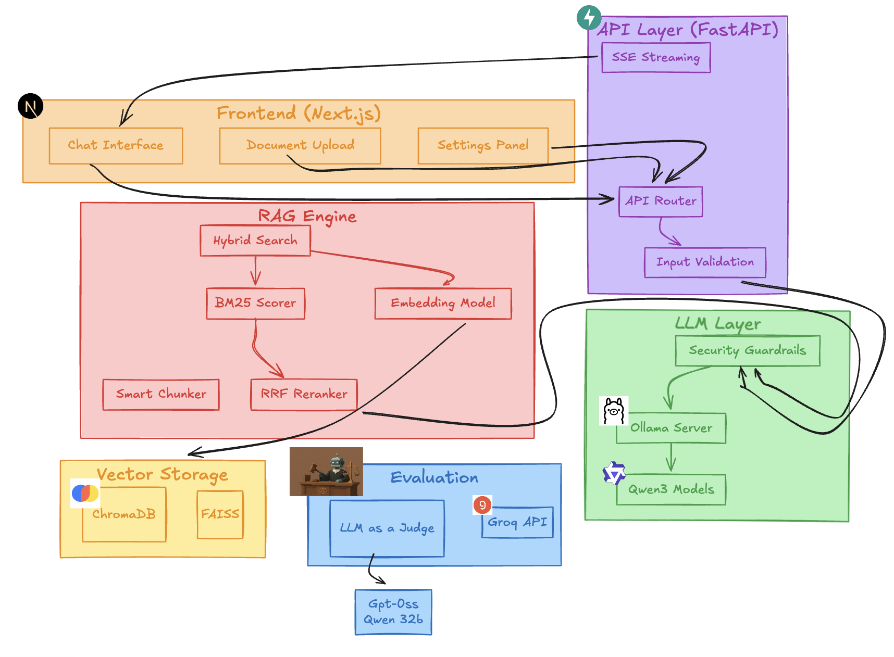
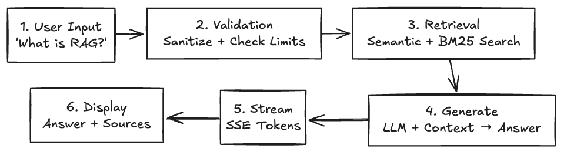
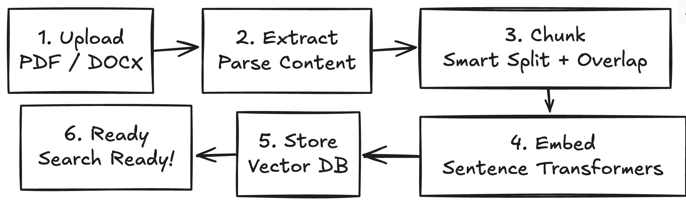
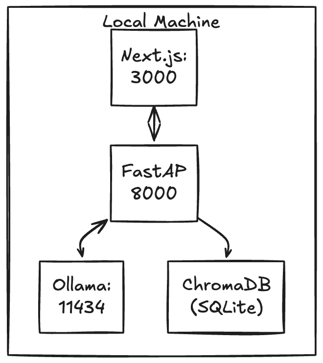

# 5. System Architecture

## End-to-End Architecture Diagram

## Data Flow

### Query Flow (User asks a question)

### Ingestion Flow (User uploads a document)

## Component Responsibilities

| Component | Responsibility | Technology |
|-----------|----------------|------------|
| **Frontend** | User interaction, real-time display | Next.js, React |
| **API Layer** | Request routing, validation, streaming | FastAPI, Uvicorn |
| **RAG Engine** | Retrieval, chunking, embedding | ChromaDB, FAISS |
| **LLM Client** | Text generation, guardrails | Ollama, qwen3 |
| **Eval System** | Quality measurement | Groq, LLM-as-Judge |

## Deployment Architecture

## Key Design Decisions

1. **Monolithic but Modular**: Single deployment, clear module boundaries
2. **Local-First**: All processing on user's machine
3. **Graceful Degradation**: FAISS optional, system works without it
4. **Streaming by Default**: Better perceived performance
5. **Dual Storage**: ChromaDB for simplicity, FAISS for scale
